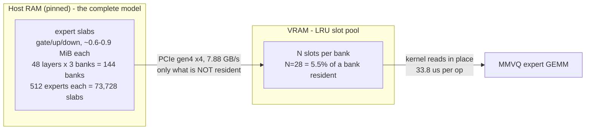
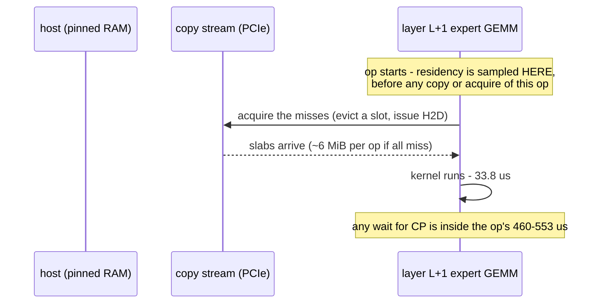
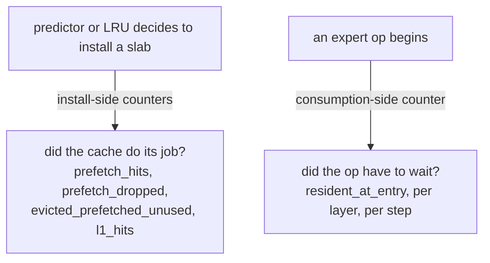

# MoE expert residency: the model behind the decode bottleneck

Scope: how expert weights move between host RAM and VRAM on this rig, which counters
answer which question, and how to read the consumption-side residency instrument that
replaces the current inferences with measurements.

Rig: Qwen3.8-Flash-Next-APEX-I-Mini (qwen4exp), 48 trunk layers, 512 experts, 10 used per
token, RTX 3060 12 GB, PCIe gen4 x4 at 7.88 GB/s measured, `--moe-expert-cache-size N`,
`--n-cpu-moe 99`, `--load-mode none`.

## 1. The four words



- **bank**: one expert tensor of one layer - gate, up or down. 48 layers x 3 = 144 banks.
- **slab**: one expert's weights inside a bank, 0.6-0.9 MiB depending on quant and role.
- **slot**: a VRAM home for exactly one slab. Each bank has its own pool of N slots.
- **need**: one (bank, expert) pair an op will read. Decode is 10 experts x 3 banks = 30
  needs per layer, 1440 needs per step. Prefill needs far more per op because a wide batch
  routes to a union of experts (~235 per bank per op on this rig).

## 2. One decode step as a timeline



## 3. Install-side versus consumption-side counters



Both questions are legitimate and they are not the same. Install-side counters fire when the
cache acts; they cannot say what a specific op inherited. Two recorded misreadings came from
using them as if they could:

- `moe-grouped-decode: ready=12240 ready_min=255` counts **plan admission**, incremented when a
  group enters `GROUPED_ACTIVE` (moe-cache.cu around 12177, 11215, 11939). It is not a statement
  that expert data is resident.
- `l1_hits`/`l1_misses` in `moe-cache-phase: phase=decode` are structurally zero on this rig
  because decode does not use the legacy cached path at all.

## 4. The preload messages, decoded

```
E moe-cache: look-ahead could not install 144 of 144 MoE expert cache pools;
             the target layers are not under legacy cache authority, so look-ahead prefetch is inert
W moe-cache: look-ahead prefetch found no installed pool for the target layer, prediction dropped
```

`preinstall_legacy_pools()` (moe-cache.cu around 13725-13763) walks every bank tensor of every
group, calls `acquire_legacy_cache(tensor)` once per tensor, and counts a failure when the
returned lease is null. The comment states the intent: "acquire_legacy_cache installs the
per-layer pool on first use and keeps it for the context lifetime; the lease is dropped
immediately." So the preload is not a data copy - it is pool creation, so that a later
prediction has somewhere to land.

Pool creation is refused unless the target group currently holds
`GGML_CUDA_MOE_GROUP_AUTHORITY_LEGACY` with admission open (moe-cache.cu 8233, 8345-8346,
8577-8578). In this configuration the decode groups do not hold that authority, so all 144
installs are refused. The prediction is then computed - the producer's router matmul and
argsort run - but the prefetch finds no pool and drops it (moe-cache.cu 13664).

Consequences, and this is the state to reason about:

- The L+1 preload contributes **zero** prefetched slabs. Decode expert traffic is entirely
  demand-driven: LRU reuse of slabs pulled in by earlier tokens, plus demand copies.
- `prefetch_dropped` moves; the two counters that would prove preloading cannot move at all,
  because nothing ever reaches the installer (`predicted-not-copied = 0`,
  `copied-not-used = 0`).
- The refusal is a design invariant, not a defect: a VRAM pool may only be created under a
  certified execution, because fit accounting does not include these pools.

## 5. The consumption-side instrument

For each grouped MoE call, before any acquire or copy belonging to that call:

1. Enumerate the op's needs, deduplicated by (bank, expert).
2. For each need, read whether that expert is resident in that bank right now. Read-only: it
   must not touch eviction age, LRU state, or any hit counter.
3. Accumulate `need`, `resident_at_entry`, `copied` per layer, with `copied = need - resident`.

Printed per decode step, per layer and in aggregate:

```
moe-resident[decode]: step=N L=XX need=30 resident=22 copied=8 copy_kib=5760
moe-resident-step[decode]: step=N need=1440 resident=958 copied=482 copy_mib=336.6 resident_pct=66.5
moe-resident-summary[decode]: steps=N need= resident= copied= copy_mib=F resident_pct=F
```

## 6. How to read the result

| resident_pct at entry | meaning | what follows |
| --- | --- | --- |
| ~100% | ops never wait; the 520 us outside the kernel is wrapper and plan bookkeeping | optimize the grouped dispatch path, not the transfers |
| ~50-65% | each op pays for its own misses inline | overlap is the lever: issue layer L+1's copies during layer L's compute, on the authority that actually owns pools |
| much lower | the pool is too small for the working set | raise N or fix eviction policy before anything else |

Per-layer variance is the second signal: if early layers churn and late layers are warm, pool
sizing should be per layer; if all 48 layers sit at the same value, it is a global overlap
problem.

Falsifiable prediction on record: `resident_pct` ~50-65%, `copied` ~330-500 MiB/token, and a
negative correlation between `resident_at_entry` and the op's measured microseconds across
layers. If `resident_pct` instead reads near 100% while the op still costs ~553 us, transfers
are exonerated, the wrapper is the whole story, and the look-ahead overlap track is dead.

## 7. Measurements this model is built on

| quantity | value | source |
| --- | --- | --- |
| expert GEMM kernel, in situ | 33.8 us/op | branch counter, `mmvq_ms=1245.32` over 36864 calls |
| expert GEMM kernel, standalone | 37.8-40.0 us/op | perf harness, RTX 3060 |
| whole op, in situ | 553 us (probe), 460 us (clean) | per-node event pairs |
| decode step | 90-120 ms | phase probe |
| MoE bucket | 67-81 ms/step, 144 ops | phase probe |
| expert H2D | 337-389 MiB/token | grouped telemetry, cache-phase lines |
| link | 7.88 GB/s gen4 x4 | harness link sampler |
| op cost vs pool size | 553 us at N=28, 749 us at N=12 | same binary, same flags |
| slab copies per step | 663 of 1440 needs (46%) | `h2d_banks=169152` over 255 steps |
| MTP, depth 1, shared Q8_0 | 9.85 t/s vs 10.91 control | same protocol, acceptance 0.789 |
| MTP, depth 1, shared Q4_K_M | 9.06 t/s vs 10.91 control | acceptance 0.814 |
| L+1 prediction quality | 86.2% recall / 69.0% coverage at width 8 | in-graph scoring, 23,936 pairs |

Assisted-by: Oh My Pi (deepseek-v4.1-flash)
